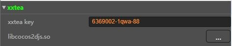
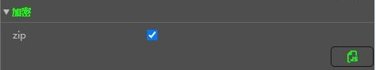
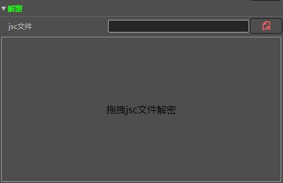
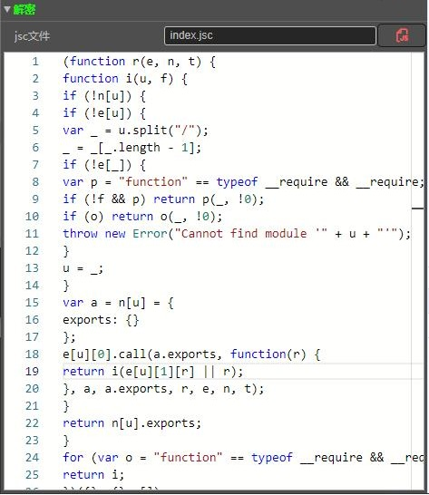
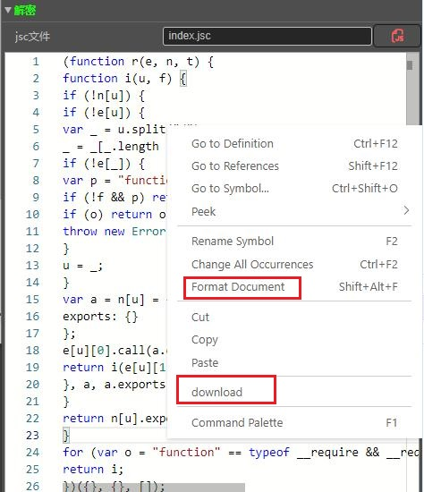

# jsc工具介绍

发布游戏时，一般我们都会对apk进行加密保护，cocos creator 也提供了加密方案，但有时我们需要排查自己游戏的错误，这就需要对自己游戏的jsc进行解密，然后根据错误信息找到对应的代码。

## 使用方法
### xxtea



选择so文件，会自动检索xxtea key，所以如果你的apk里面so没有加固，可能会被真的搜索到有效的key，这个功能是个双刃剑，方便的同时，也威胁到了自己。

## 加密



使用`xxtea key`加密`js`代码，一般我们用来检测加密出来的jsc是否和目标jsc一致，进一步确定调试的源代码是否和运行的代码一致，一般我们不会使用到该功能。

### 解密
将jsc文件拖到该区域，会自动使用`xxtea key`进行解密



如果`key`正确，则会显示出解密后的代码



在代码区域右键，`download`菜单可以下载代码到本地



## cli
运行 `build-cli` 会在dist-cli-webpack目录下生成jsc.js，

命令行执行`node ./jsc.js `会输出使用方式

```
Usage: jsc.js <xxtea_key> <jsc_file>
```